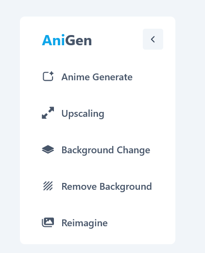
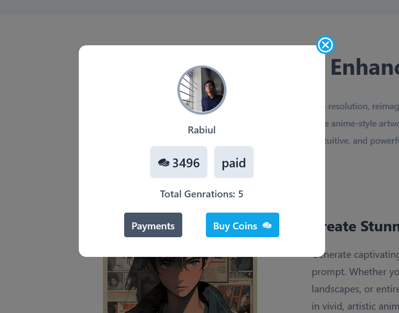

# **Anigen**

- **[Live Site Link](https://anigen.netlify.app/)**  
- **[API Repository Link](https://github.com/rabiulahsan/anime-generator-server)**  

## **Table of Contents**

1. [Overview](#overview)  
2. [Objectives](#objectives)  
3. [Technology Used](#technology-used)  
4. [Features](#features)
   - [Tools](#tools)  
   - [Profile](#feature-profile)  
   - [Pricing](#feature-pricing)  
   - [Payment](#feature-payment)  
5. [Contact Information](#contact-information)  

## **Overview**

**Anigen** is an innovative application that enables users to **generate anime images** using customized prompts, creating an enjoyable and interactive experience for art enthusiasts.  

### Key Features:
- **Image Generation**: Generate anime-style artwork based on user-provided prompts.
- **Image Tools**:  
  - **Image Upscaling**: Enhance image quality for better resolution.  
  - **Reimagining**: Transform existing images into anime-style illustrations.  
  - **Background Removal**: Seamlessly extract the subject from an image.  
  - **Background Replacement**: Replace backgrounds with custom or AI-generated visuals.  
- **Coin-Based System**:  
  Users purchase coin packages to access features:
  - **1 Coin = 1 Image Generation**  
  - Affordable, scalable, and user-friendly payment options.  

This project demonstrates expertise in **full-stack development**, **AI-powered tools integration**, and building a scalable, engaging platform for creative users.

## **Objectives**

- **Purpose**:  
  Anigen is built to empower users with AI-driven tools that enable seamless anime-style image creation and customization, making artistic expression accessible to everyone.  

- **Why It’s Good**:  
  - Encourages creativity with advanced image tools.  
  - Simplifies the process of creating professional-quality artwork.  
  - Combines innovative AI with a user-friendly interface, ensuring anyone can explore and enjoy their artistic journey.  

- **Developer Challenge**:  
  Building Anigen provided hands-on experience with full-stack technologies, payment system integrations, and the deployment of AI APIs to deliver a highly engaging application.  

## **Technology Used**

- **Frontend**: React, Tailwind CSS  
- **Backend**: Node.js, Firebase, MongoDB  
- **Authentication**: JWT  
- **Payments**: Stripe  
- **AI APIs**: Used for image generation and editing  

## **Features**

### **Tools**  
  
Provide advanced tools for image customization and enhancement.

### **Profile**  
  
Enable users to manage their profiles and track coin usage.  

### **Pricing**  
  
Offer multiple pricing plans for purchasing coins.  

### **Payment**  
(Include image or description here for Payment)  
Seamless payment gateway integration using Stripe.  

## **Contact Information**

For queries or collaboration, reach out at:  
**Email**: [ra.rabiulahsan@gmail.com](mailto:ra.rabiulahsan@gmail.com)  
<a href="https://www.linkedin.com/in/rabiul-ahsan" target="_blank">Linkedin</a>  
<a href="https://rabiulahsan.netlify.app/" target="_blank">Portfolio</a>  
